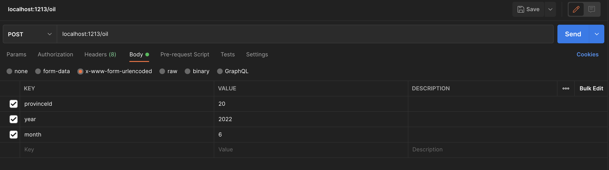

# ปตท. Oil Prices API
This API is inspired by [moom0o's gasbuddy API](https://github.com/moom0o/gasbuddy-api)
## Docs
Here's the documentation!
### Installation
**NOTICE**

If you want to use it without hosting it locally, you can send your POST requests to my server: `api.winsdominoes.net/oil`

This project requires: `git`, `node.js` and `npm`
1. Install node.js & npm
2. Do `git clone https://github.com/WinsDominoes/pttor-api`
3. Enter the project (Unix: `cd pttor-api`)
4. Do `npm install -y`
5. Start it by doing `node index.js`

### Usage
This is more of a "proxy" instead of an actual API, it retrieves the data from ปตท. / ptt's *unofficial* API then just format it to make it more easy to understand :D

To request the data, send a **POST** request to the `/oil` endpoint with the following request body. Make sure to choose `x-www-form-urlencoded` (Example in Postman)


You can change the province using their IDs, refer to the table below (This also works with ptt's original API)

<details>
<summary>Want the JSON array?</summary>

```
[
	{
		"id": 1,
		"titleTH": "กรุงเทพมหานคร",
		"titleEN": "Bangkok"
	},
	{
		"id": 2,
		"titleTH": "สมุทรปราการ",
		"titleEN": "Samut Prakarn"
	},
	{
		"id": 3,
		"titleTH": "นนทบุรี",
		"titleEN": "Nonthaburi"
	},
	{
		"id": 4,
		"titleTH": "ปทุมธานี",
		"titleEN": "Pathum Thani"
	},
	{
		"id": 5,
		"titleTH": "พระนครศรีอยุธยา",
		"titleEN": "Phra Nakhon Si Ayutthaya"
	},
	{
		"id": 7,
		"titleTH": "ลพบุรี",
		"titleEN": "Lop Buri"
	},
	{
		"id": 6,
		"titleTH": "อ่างทอง",
		"titleEN": "Ang Thong"
	},
	{
		"id": 8,
		"titleTH": "สิงห์บุรี",
		"titleEN": "Sing Buri"
	},
	{
		"id": 9,
		"titleTH": "ชัยนาท",
		"titleEN": "Chai Nat"
	},
	{
		"id": 10,
		"titleTH": "สระบุรี",
		"titleEN": "Saraburi"
	},
	{
		"id": 11,
		"titleTH": "ชลบุรี",
		"titleEN": "Chon Buri"
	},
	{
		"id": 12,
		"titleTH": "ระยอง",
		"titleEN": "Rayong"
	},
	{
		"id": 13,
		"titleTH": "จันทบุรี",
		"titleEN": "Chanthaburi"
	},
	{
		"id": 14,
		"titleTH": "ตราด",
		"titleEN": "Trat"
	},
	{
		"id": 15,
		"titleTH": "ฉะเชิงเทรา",
		"titleEN": "Chachoengsao"
	},
	{
		"id": 16,
		"titleTH": "ปราจีนบุรี",
		"titleEN": "Prachin Buri"
	},
	{
		"id": 18,
		"titleTH": "สระแก้ว",
		"titleEN": "Sa kaeo"
	},
	{
		"id": 17,
		"titleTH": "นครนายก",
		"titleEN": "Nakhon Nayok"
	},
	{
		"id": 19,
		"titleTH": "นครราชสีมา",
		"titleEN": "Nakhon Ratchasima"
	},
	{
		"id": 20,
		"titleTH": "บุรีรัมย์",
		"titleEN": "Buri Ram"
	},
	{
		"id": 21,
		"titleTH": "สุรินทร์",
		"titleEN": "Surin"
	},
	{
		"id": 22,
		"titleTH": "ศรีสะเกษ",
		"titleEN": "Si Sa Ket"
	},
	{
		"id": 23,
		"titleTH": "อุบลราชธานี",
		"titleEN": "Ubon Ratchathani"
	},
	{
		"id": 24,
		"titleTH": "ยโสธร",
		"titleEN": "Yasothon"
	},
	{
		"id": 25,
		"titleTH": "ชัยภูมิ",
		"titleEN": "Chaiyaphum"
	},
	{
		"id": 26,
		"titleTH": "อำนาจเจริญ",
		"titleEN": "Amnat Charoen"
	},
	{
		"id": 27,
		"titleTH": "หนองบัวลำภู",
		"titleEN": "Nong Bua Lam Phu"
	},
	{
		"id": 29,
		"titleTH": "อุดรธานี",
		"titleEN": "Udon Thani"
	},
	{
		"id": 28,
		"titleTH": "ขอนแก่น",
		"titleEN": "Khon Kaen"
	},
	{
		"id": 30,
		"titleTH": "เลย",
		"titleEN": "Loei"
	},
	{
		"id": 31,
		"titleTH": "หนองคาย",
		"titleEN": "Nong Khai"
	},
	{
		"id": 32,
		"titleTH": "มหาสารคาม",
		"titleEN": "Maha Sarakham"
	},
	{
		"id": 33,
		"titleTH": "ร้อยเอ็ด",
		"titleEN": "Roi Et"
	},
	{
		"id": 34,
		"titleTH": "กาฬสินธุ์",
		"titleEN": "Kalasin"
	},
	{
		"id": 35,
		"titleTH": "สกลนคร",
		"titleEN": "Sakon Nakhon"
	},
	{
		"id": 36,
		"titleTH": "นครพนม",
		"titleEN": "Nakhon Phanom"
	},
	{
		"id": 37,
		"titleTH": "มุกดาหาร",
		"titleEN": "Mukdahan"
	},
	{
		"id": 38,
		"titleTH": "เชียงใหม่",
		"titleEN": "Chiang Mai"
	},
	{
		"id": 39,
		"titleTH": "ลำพูน",
		"titleEN": "Lamphun"
	},
	{
		"id": 40,
		"titleTH": "ลำปาง",
		"titleEN": "Lampang"
	},
	{
		"id": 41,
		"titleTH": "อุตรดิตถ์",
		"titleEN": "Uttaradit"
	},
	{
		"id": 42,
		"titleTH": "แพร่",
		"titleEN": "Phrae"
	},
	{
		"id": 43,
		"titleTH": "น่าน",
		"titleEN": "Nan"
	},
	{
		"id": 44,
		"titleTH": "พะเยา",
		"titleEN": "Phayao"
	},
	{
		"id": 45,
		"titleTH": "เชียงราย",
		"titleEN": "Chiang Rai"
	},
	{
		"id": 46,
		"titleTH": "แม่ฮ่องสอน",
		"titleEN": "Mae Hong Son"
	},
	{
		"id": 47,
		"titleTH": "นครสวรรค์",
		"titleEN": "Nakhon Sawan"
	},
	{
		"id": 48,
		"titleTH": "อุทัยธานี",
		"titleEN": "Uthai Thani"
	},
	{
		"id": 49,
		"titleTH": "กำแพงเพชร",
		"titleEN": "Kamphaeng Phet"
	},
	{
		"id": 50,
		"titleTH": "ตาก",
		"titleEN": "Tak"
	},
	{
		"id": 51,
		"titleTH": "สุโขทัย",
		"titleEN": "Sukhothai"
	},
	{
		"id": 52,
		"titleTH": "พิษณุโลก",
		"titleEN": "Phitsanulok"
	},
	{
		"id": 53,
		"titleTH": "พิจิตร",
		"titleEN": "Phichit"
	},
	{
		"id": 54,
		"titleTH": "เพชรบูรณ์",
		"titleEN": "Phetchabun"
	},
	{
		"id": 55,
		"titleTH": "ราชบุรี",
		"titleEN": "Ratchaburi"
	},
	{
		"id": 56,
		"titleTH": "กาญจนบุรี",
		"titleEN": "Kanchanaburi"
	},
	{
		"id": 57,
		"titleTH": "สุพรรณบุรี",
		"titleEN": "Suphan Buri"
	},
	{
		"id": 58,
		"titleTH": "นครปฐม",
		"titleEN": "Nakhon Pathom"
	},
	{
		"id": 59,
		"titleTH": "สมุทรสาคร",
		"titleEN": "Samut Sakhon"
	},
	{
		"id": 60,
		"titleTH": "สมุทรสงคราม",
		"titleEN": "Samut Songkhram"
	},
	{
		"id": 61,
		"titleTH": "เพชรบุรี",
		"titleEN": "Phetchaburi"
	},
	{
		"id": 62,
		"titleTH": "ประจวบคีรีขันธ์",
		"titleEN": "Prachuap Khiri Khan"
	},
	{
		"id": 63,
		"titleTH": "นครศรีธรรมราช",
		"titleEN": "Nakhon Si Thammarat"
	},
	{
		"id": 64,
		"titleTH": "กระบี่",
		"titleEN": "Krabi"
	},
	{
		"id": 65,
		"titleTH": "พังงา",
		"titleEN": "Phang-nga"
	},
	{
		"id": 66,
		"titleTH": "ภูเก็ต",
		"titleEN": "Phuket"
	},
	{
		"id": 67,
		"titleTH": "สุราษฎร์ธานี",
		"titleEN": "Surat Thani"
	},
	{
		"id": 68,
		"titleTH": "ระนอง",
		"titleEN": "Ranong"
	},
	{
		"id": 69,
		"titleTH": "ชุมพร",
		"titleEN": "Chumphon"
	},
	{
		"id": 70,
		"titleTH": "สงขลา",
		"titleEN": "Songkhla"
	},
	{
		"id": 71,
		"titleTH": "สตูล",
		"titleEN": "Satun"
	},
	{
		"id": 72,
		"titleTH": "ตรัง",
		"titleEN": "Trang"
	},
	{
		"id": 73,
		"titleTH": "พัทลุง",
		"titleEN": "Phatthalung"
	},
	{
		"id": 74,
		"titleTH": "ปัตตานี",
		"titleEN": "Pattani"
	},
	{
		"id": 75,
		"titleTH": "ยะลา",
		"titleEN": "Yala"
	},
	{
		"id": 76,
		"titleTH": "นราธิวาส",
		"titleEN": "Narathiwat"
	},
	{
		"id": 77,
		"titleTH": "บึงกาฬ",
		"titleEN": "Bueng Kan"
	}
]
```

</details>

| id  | TH              | EN                  |
| --- | --------------- | ------------------------ |
| 1   | กรุงเทพมหานคร   | Bangkok                  |
| 2   | สมุทรปราการ     | Samut Prakarn            |
| 3   | นนทบุรี         | Nonthaburi               |
| 4   | ปทุมธานี        | Pathum Thani             |
| 5   | พระนครศรีอยุธยา | Phra Nakhon Si Ayutthaya |
| 6   | อ่างทอง         | Ang Thong                |
| 7   | ลพบุรี          | Lop Buri                 |
| 8   | สิงห์บุรี       | Sing Buri                |
| 9   | ชัยนาท          | Chai Nat                 |
| 10  | สระบุรี         | Saraburi                 |
| 11  | ชลบุรี          | Chon Buri                |
| 12  | ระยอง           | Rayong                   |
| 13  | จันทบุรี        | Chanthaburi              |
| 14  | ตราด            | Trat                     |
| 15  | ฉะเชิงเทรา      | Chachoengsao             |
| 16  | ปราจีนบุรี      | Prachin Buri             |
| 17  | นครนายก         | Nakhon Nayok             |
| 18  | สระแก้ว         | Sa kaeo                  |
| 19  | นครราชสีมา      | Nakhon Ratchasima        |
| 20  | บุรีรัมย์       | Buri Ram                 |
| 21  | สุรินทร์        | Surin                    |
| 22  | ศรีสะเกษ        | Si Sa Ket                |
| 23  | อุบลราชธานี     | Ubon Ratchathani         |
| 24  | ยโสธร           | Yasothon                 |
| 25  | ชัยภูมิ         | Chaiyaphum               |
| 26  | อำนาจเจริญ      | Amnat Charoen            |
| 27  | หนองบัวลำภู     | Nong Bua Lam Phu         |
| 28  | ขอนแก่น         | Khon Kaen                |
| 29  | อุดรธานี        | Udon Thani               |
| 30  | เลย             | Loei                     |
| 31  | หนองคาย         | Nong Khai                |
| 32  | มหาสารคาม       | Maha Sarakham            |
| 33  | ร้อยเอ็ด        | Roi Et                   |
| 34  | กาฬสินธุ์       | Kalasin                  |
| 35  | สกลนคร          | Sakon Nakhon             |
| 36  | นครพนม          | Nakhon Phanom            |
| 37  | มุกดาหาร        | Mukdahan                 |
| 38  | เชียงใหม่       | Chiang Mai               |
| 39  | ลำพูน           | Lamphun                  |
| 40  | ลำปาง           | Lampang                  |
| 41  | อุตรดิตถ์       | Uttaradit                |
| 42  | แพร่            | Phrae                    |
| 43  | น่าน            | Nan                      |
| 44  | พะเยา           | Phayao                   |
| 45  | เชียงราย        | Chiang Rai               |
| 46  | แม่ฮ่องสอน      | Mae Hong Son             |
| 47  | นครสวรรค์       | Nakhon Sawan             |
| 48  | อุทัยธานี       | Uthai Thani              |
| 49  | กำแพงเพชร       | Kamphaeng Phet           |
| 50  | ตาก             | Tak                      |
| 51  | สุโขทัย         | Sukhothai                |
| 52  | พิษณุโลก        | Phitsanulok              |
| 53  | พิจิตร          | Phichit                  |
| 54  | เพชรบูรณ์       | Phetchabun               |
| 55  | ราชบุรี         | Ratchaburi               |
| 56  | กาญจนบุรี       | Kanchanaburi             |
| 57  | สุพรรณบุรี      | Suphan Buri              |
| 58  | นครปฐม          | Nakhon Pathom            |
| 59  | สมุทรสาคร       | Samut Sakhon             |
| 60  | สมุทรสงคราม     | Samut Songkhram          |
| 61  | เพชรบุรี        | Phetchaburi              |
| 62  | ประจวบคีรีขันธ์ | Prachuap Khiri Khan      |
| 63  | นครศรีธรรมราช   | Nakhon Si Thammarat      |
| 64  | กระบี่          | Krabi                    |
| 65  | พังงา           | Phang-nga                |
| 66  | ภูเก็ต          | Phuket                   |
| 67  | สุราษฎร์ธานี    | Surat Thani              |
| 68  | ระนอง           | Ranong                   |
| 69  | ชุมพร           | Chumphon                 |
| 70  | สงขลา           | Songkhla                 |
| 71  | สตูล            | Satun                    |
| 72  | ตรัง            | Trang                    |
| 73  | พัทลุง          | Phatthalung              |
| 74  | ปัตตานี         | Pattani                  |
| 75  | ยะลา            | Yala                     |
| 76  | นราธิวาส        | Narathiwat               |
| 77  | บึงกาฬ          | Bueng Kan                |


Now after choosing your province, you can then submit the POST request and here's what you *should* get:
```
{
    "success": true,
    "message": "Success",
    "data": {
        "date": "2022-06-14T05:00:00",
        "year": 2022,
        "month": 6,
        "day": 14,
        "province": {
            "id": 20,
            "titleTH": "บุรีรัมย์",
            "titleEN": "Buri Ram"
        },
        "district": {
            "id": 179,
            "titleTH": "เมืองบุรีรัมย์",
            "titleEN": "Mueang Buri Ram"
        },
        "priceData": [
            {
                "OilTypeId": 5,
                "Price": 35.36,
                "PriceDate": "2022-06-14T05:00:00"
            },
            {
                "OilTypeId": 2,
                "Price": 35.36,
                "PriceDate": "2022-06-14T05:00:00"
            },
            {
                "OilTypeId": 17,
                "Price": 35.36,
                "PriceDate": "2022-06-14T05:00:00"
            },
            {
                "OilTypeId": 12,
                "Price": 37.96,
                "PriceDate": "2022-06-14T05:00:00"
            },
            {
                "OilTypeId": 11,
                "Price": 44.46,
                "PriceDate": "2022-06-14T05:00:00"
            },
            {
                "OilTypeId": 10,
                "Price": 45.3,
                "PriceDate": "2022-06-14T05:00:00"
            },
            {
                "OilTypeId": 9,
                "Price": 45.57,
                "PriceDate": "2022-06-14T05:00:00"
            },
            {
                "OilTypeId": 7,
                "Price": 52.98,
                "PriceDate": "2022-06-14T05:00:00"
            },
            {
                "OilTypeId": 1,
                "Price": 46.78,
                "PriceDate": "2022-06-14T05:00:00"
            },
            {
                "OilTypeId": 22,
                "Price": 51.06,
                "PriceDate": "2022-06-14T05:00:00"
            }
        ]
    }
}
```

All of your data is in the `data` object, the date is in `date`, `year`, `month` and `day` objects.
The province info can be found in the `province` object and the district info can be found in the `district` object, both are provided with Thai and English names. 

Now the Oil price data can be found in the `priceData` object. Each of them contains the `OilTypeId`, the `Price` and the `PriceDate` (The time when they reported the price).

The price is in Thai Baht.

Refer to the following table for the Oil Types and its ID.

| ID | Name |
|----|------|
| 1  |      |
| 2  |      |
| 5  |      |
| 7  |      |
| 9  |      |
| 10 |      |
| 11 |      |
| 12 |      |
| 17 |      |
| 22 |      |